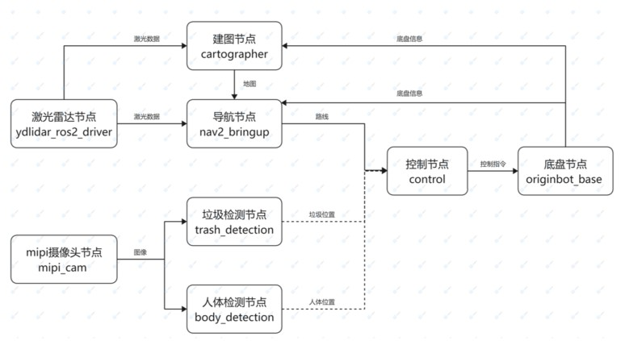

# indoor_service_robot

室内服务机器人Demo能够实现机器人导航到指定位置，并对周围的物体进行检测的功能。

为实现上述功能，我们需要激光雷达，摄像头，运动底盘以及计算平台。

对应的模块有：

1. 激光雷达模块：获取周围障碍物的准确位置并传递给建图模块和导航模块

2. 底盘模块：发布底盘信息用于建图和导航，同时接收控制模块的控制消息，拆分为各电机的控制，实现机器人运动

3. 建图模块：接收激光雷达的激光数据与底盘的消息并建立当前环境的地图

4. 导航模块：接收激光雷达的激光数据与底盘的消息并读取已保存的地图，规划出机器人运动到指定位置的路线

5. 摄像头模块：获取周围环境的图像并传递给垃圾检测模块和人体检测模块

6. 垃圾检测模块：接收摄像头的图像并识别出垃圾在图像中的位置

7. 人体检测模块：接收摄像头的图像并识别出人体在图像中的位置

8. 控制模块：接收导航模块的路线消息，垃圾检测模块和人体检测模块的物体位置信息，控制机器人运动


该Demo支持小车自动导航的同时进行视觉检测，但控制方面只按照导航的指令运动，若希望增加垃圾定位，人体跟随等功能，可自行开发控制节点

整体链路如图所示：


接下来需要对以上所有的模块进行详细说明，[NodeHub](https://developer.horizon.cc/nodehub)是地平线为广大开发者提供给的“智能机器人应用中心”，该应用中心中包含各种不同功能的开源Node，能够快速安装和使用，通过串联不同的Node可以完成室内服务机器人的搭建

# 实现细节

## 激光雷达模块
[NodeHub](https://developer.horizon.cc/nodehub)中“外设适配”栏目包含多种传感器，包括各类相机以及激光雷达，可以快速部署使用，请按照实际的激光雷达型号选择，这里以[YDLIADAR激光雷达驱动](https://developer.horizon.cc/nodehubdetail/167289845913411078)为例。

查看《YDLIADAR激光雷达驱动》Node可知：

该Node发布话题名称为/scan，话题类型为/sensor_msgs/LaserScan

若安装时YDLIDR已连接在RDK X3上，则安装完后需要重新拔插一次

点击Node页面“一键部署”按钮，将生成的如下命令拷贝至RDK X3终端运行

```shell
sudo apt update
sudo apt install -y tros-ydlidar-ros2-driver
```

在完成“一键部署”后，启动该Node的命令为
```shell
# 设置tros的环境变量
source /opt/tros/setup.bash

# 设置ros的环境变量
source /opt/ros/foxy/setup.bash

ros2 launch ydlidar_ros2_driver ydlidar_launch.py
```

## 底盘模块
[NodeHub](https://developer.horizon.cc/nodehub)中“外设适配”栏目包含多种机器人底盘，需要按照实际的机器人型号选择，此处以[Originbot底盘驱动](https://developer.horizon.cc/nodehubdetail/170117036053371431)为例，该节点发布里程计的数据用于建图和导航，同时接收控制节点的消息，分解为对各个电机的控制，从而实现小车运动

查看《Originbot底盘驱动》Node可知：

该Node订阅/cmd_vel话题，类型为geometry_msgs/msg/Twist，此话题与控制Node发布的话题一致，用于获取控制信息进行电机控制；

发布/originbot_status、/odom、/tf_static三个话题，分别是机器人状态，里程计消息以及机器人坐标系信息

点击Node页面“一键部署”按钮，将生成的如下命令拷贝至RDK X3终端运行

```shell
sudo apt update
sudo apt install -y tros-originbot-base tros-serial tros-originbot-msgs
```

在完成“一键部署”后，启动该Node的命令为
```shell
# 设置tros的环境变量
source /opt/tros/setup.bash

# 设置ros的环境变量
source /opt/ros/foxy/setup.bash

ros2 launch originbot_base robot.launch.py 
```

## 建图模块

[NodeHub](https://developer.horizon.cc/nodehub)中“环境感知”栏目中[Cartographer激光雷达SLAM](https://developer.horizon.cc/nodehubdetail/170117036053371409)能够接收激光雷达的激光数据与底盘的消息并建立当前环境的地图。

查看《Cartographer激光雷达SLAM》Node可知：

该Node订阅话题有/odom，/scan，对应底盘模块和激光雷达模块发布的消息，用于获取激光雷达的激光数据与底盘的消息建立地图

发布话题有/map，可用于在rviz2可视化建图的效果

点击Node页面“一键部署”按钮，将生成的如下命令拷贝至RDK X3终端运行

```shell
sudo apt update
sudo apt install -y tros-hobot-cartographer
```

在完成“一键部署”后，启动该Node的命令为
```shell
# 设置tros的环境变量
source /opt/tros/setup.bash

# 设置ros的环境变量
source /opt/ros/foxy/setup.bash

ros2 launch hobot_cartographer cartographer.launch.py
```

建图过程中可以在同一网段下的PC端打开rviz2，添加Map和TF等显示项，查看建图效果

```shell
# 设置ros的环境变量(此处以foxy为例)
source /opt/ros/foxy/setup.bash

ros2 run rviz2 rviz2
```

在建图时，还需要新开一个终端用于控制小车运动，以建立完整的地图（建议放慢速度，注意不要撞到东西）

```shell
# 设置tros的环境变量
source /opt/tros/setup.bash

# 设置ros的环境变量
source /opt/ros/foxy/setup.bash

ros2 run teleop_twist_keyboard teleop_twist_keyboard
```

建图完成之后，保存地图到当前的路径下，保存完成后可以把建图节点关掉

```shell
# 安装tros-hobot-nav2
sudo apt install -y tros-hobot-nav2

# 设置tros的环境变量
source /opt/tros/setup.bash

# 设置ros的环境变量
source /opt/ros/foxy/setup.bash

ros2 run nav2_map_server map_saver_cli -f my_map --ros-args -p save_map_timeout:=10000
```

## 导航模块

[NodeHub](https://developer.horizon.cc/nodehub)中“环境感知”栏目中[Nav2移动机器人自主导航](https://developer.horizon.cc/nodehubdetail/170117036053371397)接收激光雷达的激光数据与底盘的消息并读取已保存的地图，规划出机器人运动到指定位置的路线。

由于建图模块保存地图时已安装过nav2功能包，此处无需再安装

启动导航节点前建议重启激光雷达节点与底盘节点

导航节点的接口及参数调整方式可参考[NAV2调参说明](https://navigation.ros.org/setup_guides/index.html)

启动该Node的命令为
```shell
# 设置tros的环境变量
source /opt/tros/setup.bash

# 设置ros的环境变量
source /opt/ros/foxy/setup.bash

# 运行nav2
ros2 launch hobot_nav2 hobot_nav2_bringup.launch.py
```

可视化导航过程
```shell
# 设置ros的环境变量(此处以foxy为例)
source /opt/ros/foxy/setup.bash

ros2 launch nav2_bringup rviz_launch.py
```

导航启动后，机器人最初不知道自己在哪里。默认情况下，Nav2会等待用户给机器人一个大致的起始位置。在地图加载完成之后，点击Rviz2中的”2D Pose Estimate” 按钮，在地图上机器人预估的位置处点击来设置机器人初始位置。通过激光雷达扫描到的障碍物与地图上的障碍物是否吻合判断初始位置是否准确，大致匹配即可。确定初始位置之后，点击“2D Goal Pose”按钮，在地图上选择导航目标点，即可开始自主导航。

## 垃圾检测模块

[NodeHub](https://developer.horizon.cc/nodehub)“环境感知”栏目中[2D垃圾检测](https://developer.horizon.cc/nodehubdetail/168958376283445776)接收摄像头发布的图像信息，使用PPYOLO模型检测出图像中的垃圾。

查看《2D垃圾检测》Node可知：

该Node订阅话题/hbmem_img，类型为hbm_img_msgs/msg/HbmMsg1080P，此话题与摄像头模块发布的话题一致，可以获取摄像头发布的图像数据

发布话题/ai_msg_mono2d_trash_detetion，其中包含了检测到的垃圾在图像中的位置

启动脚本中包含了摄像头节点的启动（支持USB与MIPI两类摄像头，此处为后者），所以无需再另外启动摄像头

```shell
# 配置ROS2环境
source /opt/tros/setup.bash

# 从tros的安装路径中拷贝出运行示例需要的配置文件。
cp -r /opt/tros/lib/mono2d_trash_detection/config/ .

# 配置MIPI摄像头
export CAM_TYPE=mipi

# 启动launch文件
ros2 launch dnn_node_example dnn_node_example.launch.py dnn_example_config_file:=config/ppyoloworkconfig.json dnn_example_msg_pub_topic_name:=ai_msg_mono2d_trash_detection dnn_example_image_width:=1920 dnn_example_image_height:=1080
```

## 人体检测模块
[NodeHub](https://developer.horizon.cc/nodehub)“人机交互”栏目中[人体与骨骼关键点检测](https://developer.horizon.cc/nodehubdetail/168637224398835209)接收摄像头发布的图像信息，使用fasterRcnn模型检测出人体以及人体骨骼关键点。

查看《人体骨骼关键点》Node可知：

该Node订阅话题/hbmem_img，类型为hbm_img_msgs/msg/HbmMsg1080P，此话题与摄像头模块发布的话题一致，可以获取摄像头发布的图像数据

发布话题/hobot_mono2d_body_detection，其中包含人体骨骼关键点在图像中的位置

由于摄像头节点在垃圾检测模块中已经打开，所以此处启动人体检测模块时，选择不带摄像头启动的脚本

```shell
# 配置tros.b环境
source /opt/tros/setup.bash

# 从tros.b的安装路径中拷贝出运行示例需要的配置文件。
cp -r /opt/tros/lib/mono2d_body_detection/config/ .

# 配置MIPI摄像头
export CAM_TYPE=mipi

# 启动launch文件（不带摄像头启动）
ros2 launch mono2d_body_detection mono2d_body_detection_without_camera.launch.py
```

至此，室内服务机器人Demo已经搭建完成